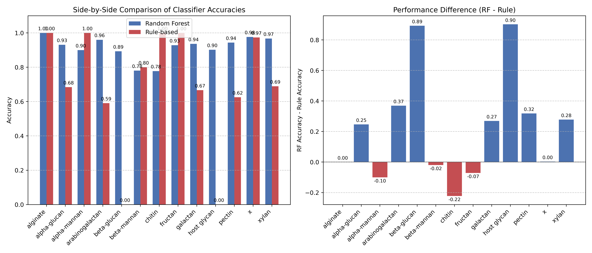

# Identifying PUL Signatures In Experimentally-Validated PULs

The latest dbCAN-PUL collection (v5) and its associated substrate mapping file from dbCAN2 were used to attempt to identify PUL signatures that could help formulate PUL prediction models.  

## Pre-processing

The relevant features were extracted and reshaped to create [pul_features.csv](results/pul_features.csv) used for subsequent analysis. 
A total of 671 experimentally-reported PULs and 16 unique associated substrates were identified.
Besides the main features, a column was added for the count of each CAZyme family to be later used in the training of the ML classifier.

## Substrate-Based PUL Signatures 

Next, I grouped the PULs sharing the same substrate to identify the most common CAZymes per substrate group. Then, I identified single CAZymes and CAZyme pairs with a presence frequency exceeding a threshold (defined as half the size of a given group) as potential PUL signature elements. 

## Simple Rules Formulation

Using the identified signatures, simple models were created for the different substrate-based PUL groups. As highlighted below, the current rules only include up to 3 mandatory CAZymes and CAZyme pairs, as well as a minimum number of required CAZymes and a typical genomic size (taken as the median of all the PUL region sizes in a given group):

```python
avg_cazyme_count = sub_puls['CAZyme_Count'].mean()
median_size = sub_puls['Size'].median()
        
rule_sets[substrate] = {'required_cazymes': sig['cazyme_signatures'][:3] if sig['cazyme_signatures'] else [],
                        'cazyme_combinations': sig['combination_signatures'][:3] if sig['combination_signatures'] else [],
                        'min_cazymes': max(1, int(avg_cazyme_count * 0.5)),  # At least 50% of average
                        'typical_size': median_size}
```

## Random Forest Classifier 

An RF model was also trained on the exctrated pul features to examine the extent of predictibility that could be achieved through our data, and to compare its predictions to those achieved by the previously defined rules.
This classifier simply uses the presence-absence patterns of all CAZyme families (added as features in [pul_features.csv](results/pul_features.csv)) to predict the substrate of a given PUL.

## Evaluation of Predictions

Finally, substrate predictions were done using both the RF classifier and the signature-based defined rules. A comparison of the performance of the two approaches is presented below:




