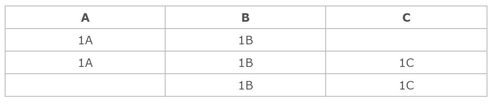
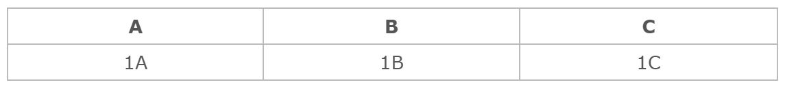

# Conserved spot script

PANORAMA can identify conserved spots across multiple pangenomes and generate flat files. A spot is deemed conserved 
when there is similarity among multiple families at the borders of spots in different pangenomes.

## Extract spot borders
### write_borders_spot

 
The function "write_borders_spot" extracts the spots borders detected by 
<a href="https://github.com/labgem/PPanGGOLiN" target="_blank">PPanGGOLiN</a>. It returns a Dataframe 
containing relevant information, such as the pangenome name, spot ID, the number of organisms and the borders. It's 
important to note that PPanGGOLiN allows for slight variation in the border content. However, in this case, only the 
configuration with the highest number of organisms is retained. 
The function also returns a dataframe indicating the number of organisms per spot.

## Conserved spot
### identical_spot

 
The function "identical_spot" recognizes similar spots across pangenomes.  
 
The initial step involves creating a dictionary, where each family serves as a key, and its corresponding value is 
a list of similar families across pangenomes. The dataframe used to construct this dictionary is generated 
by the "all_against_all" function from the align.py script.  
 
In the second step, the process involves identifying, for each pangenome, spots that have similar families at their 
borders. To achieve this, there are four loops:  
- In the first loop, we iterate through the pangenomes. For each pangenome, we create a dictionary where spot_IDs are 
used as keys, and their respective borders are stored as values. The dataframe used to construct this dictionary 
is generated by the <a href="#border" title="Go to write_borders_spot function">"write_borders_spot"</a> function.  
- In the second loop, we iterate through the previously created dictionary. For the border of each spot, we identify 
if there are duplicate or triplicate families. The term "query" is used in the code because that border is compared to 
every other border.  
Additionally, a dataframe is defined here with three columns: pangenome name, spot ID, and a score (currently set to 0).
This dataframe contains all spots from all pangenomes.  
- In the third loop, we iterate through families of the border. We use the dictionary created in the initial step to
extract, for each family, the list of similar families across pangenomes. With this information, we then identify spots
that have at least one similar family in their borders.  
- In the fourth loop, we iterate through spots that had at least one similar family in their borders. For each spot, 
we check if there are duplicate or triplicate families in the border. The term "target" is used in the code because 
that border is compared to the query. For each spot, we add one point to the score column value, indicating that one 
family of the border is similar. The value added to the score differs based on whether there are duplicate or triplicate
families in the query or target.  
At the end of the third loop, each spot is assigned a score between 0 and 6 based on the number of similar families it 
has. The user has chosen a threshold value that will filter the dataframe, keeping only the spots that surpass the 
threshold based on their scores. Afterward, the spots passing the threshold will be stored as a row in another dataframe,
where each pangenome will have its own column. Each row will either contain the spot_ID or remain empty, 
depending on whether similar spots were found or not in the corresponding pangenome.  

Upon the completion of all the loops, the dataframe will contain similar rows that need to be merged or combined.  
The dataframe undergoes processing through the functions <a href="#filter" title="Go to filter_spot function">
"filter_spot"</a> and <a href="#regroup" title="Go to regroup_spot function">"regroup_spot"</a> to filter and merge 
its content. Each row corresponds to a conserved spot.  
The function <a href="#asso" title="Go to asso_conserved_spot function">"asso_conserved_spot"</a> is executed to write 
information about all conserved spots linked to a system and to provide detailed information about the content of each 
conserved spot.

### filter_spot

 
The function "filter_spot" returns a dataframe with only the rows that contain at least one spot having at least 
one system in their content.

### regroup_spot

 
The function "regroup_spot" returns a dataframe with merged rows.  
For example : We have three pangenomes A, B and C, each with their respective spots 1A, 1B, and 1C. The threshold is 
set to 4.

 
When examining pangenome A, it was found that spot 1A has a similar border to spot 1B, meaning they share at least four 
families in common. In pangenome B, spot 1B was found to have a similar border to spots 1A and 1C. Similarly, in 
pangenome C, spot 1C was found to have a similar border to spot 1B. These rows need to be merged because they are 
considered similar.  
Even though 1A and 1C do not share four common families, they are still considered similar because their borders are 
similar to the same spot border (1B).  

<i> Note: If the threshold is set to 6, which represents 100% of similar families, the line will be triplicated
(not like 1A and 1C). </i>

The final rows generated by the "regroup_spot" function appear as follows.

### asso_conserved_spot

 
The function "asso_conserved_spot" writes a global file containing information about all conserved spots linked to a 
system.  
Additionally, it provides separate files with detailed information about the content of each conserved spot. 
The additional details include the pangenome name, spot ID, system names, organism names, border content, number of 
systems, total number of organisms having the spot and at least one system, total number of organisms having the spot, 
average number of genes inside the spot, maximal number of genes inside the spot, and minimal number of genes inside 
the spot.

 